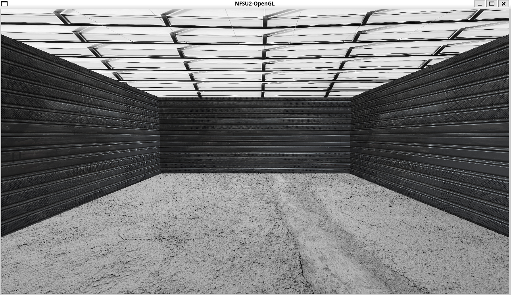

# NFSU2-OpenGL

Need For Speed Underground 2 garage recreation with OpenGL and GLUT.

<p align="center">
  
</p>
<p align="center"><em>NFSU2 Garage - Overview</em></p>

## Dependencies

- [g++](https://gcc.gnu.org/) (C++17 compiler)
- [Meson](https://mesonbuild.com/) (build system)
- [freeglut](http://freeglut.sourceforge.net/) (OpenGL, GLU and GLUT)

## Installation

### Linux

```bash
sudo apt install meson build-essential libgl-dev libglu-dev freeglut3-dev
```

## Build and run

```bash
meson setup build
meson compile -C build
./build/src/nfsu2-opengl
```

To recompile after changes:

```bash
meson compile -C build
```

## Controls

| Key | Action |
|-----|--------|
| ESC | Quit   |

## Todo

- [X] Meson build structure
- [X] Basic garage implementation
- [X] Initial texture support with stb_image
- [ ] Debug build mode with free camera movement
- [ ] Add elements from each practical activity
- [ ] Simplified car
- [ ] Lighting
- [X] Dedicated floor texture
- [X] Dedicated ceiling texture
- [ ] Rotating circular platform in the center of the garage
- [ ] Implement bump mapping for the walls
