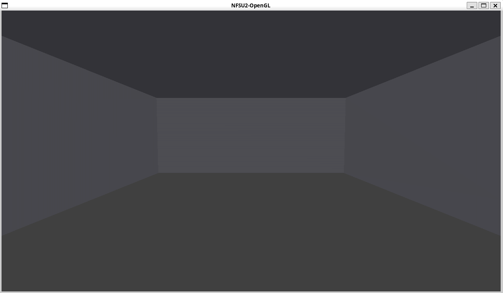

# NFSU2-OpenGL

Garagem do Need For Speed Underground 2 com OpenGL e GLUT.

<p align="center">
  
</p>
<p align="center"><em>Garagem NFSU2 - Visão geral</em></p>

## Dependências


- [g++](https://gcc.gnu.org/) (Compilador para C++17)
- [Meson](https://mesonbuild.com/) (Sistema de build)
- [freeglut](http://freeglut.sourceforge.net/) (OpenGL, GLU e GLUT)

## Instalação

### Linux

```bash
sudo apt install meson build-essential libgl-dev libglu-dev freeglut3-dev
```

## Compilar e executar

```bash
meson setup build
meson compile -C build
./build/src/nfsu2-opengl
```

Para recompilar após mudanças:

```bash
meson compile -C build
```

## Controles

| Tecla | Ação         |
|-------|--------------|
| ESC   | Encerrar     |

## Todo

- [X] Adicionar estrutura para o meson
- [X] Implementar garagem básica
- [ ] Adicionar modo de build_debug onde é possível mover a câmera
- [ ] No geral, Adicionar elementos de cada atividade prática
