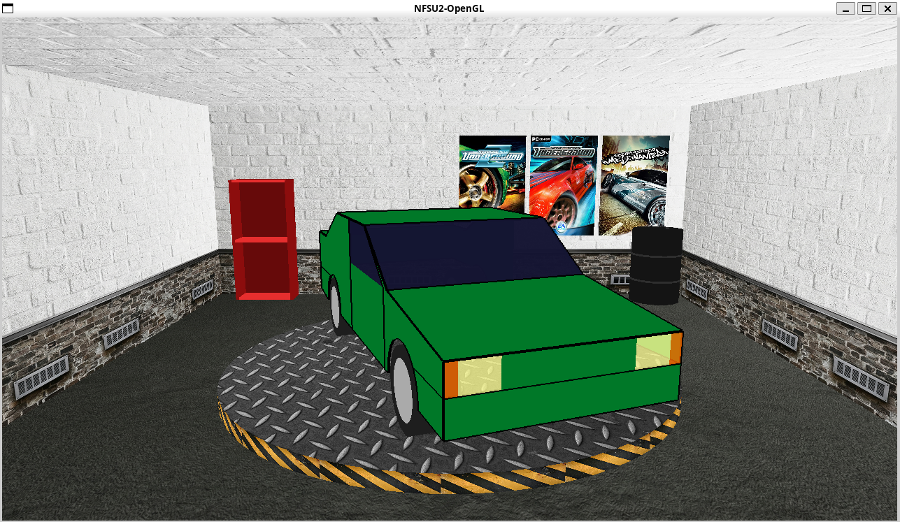

# NFSU2-OpenGL

Need For Speed Underground 2 garage recreation with OpenGL and GLUT.

<p align="center">
  
</p>
<p align="center"><em>NFSU2 Garage - Overview</em></p>

## Dependencies

- [g++](https://gcc.gnu.org/) (C++17 compiler)
- [Meson](https://mesonbuild.com/) (build system)
- [freeglut](http://freeglut.sourceforge.net/) (OpenGL, GLU and GLUT)

## Installation

### Linux

```bash
sudo apt install meson build-essential libgl-dev libglu-dev freeglut3-dev
```

## Build and run

```bash
meson setup build
meson compile -C build
./build/src/nfsu2-opengl
```

To recompile after changes:

```bash
meson compile -C build
```

## Controls

| Key | Action |
|-----|--------|
| ESC | Quit   |
| Left mouse drag | Rotate platform |
| m | enable/disable camera movement |
| a | rotate camera left |
| d | rotate camera right |
| w | bring the camera closer |
| s | move the camera away |
| space | move the camera up |
| z | move the camera down |
| p | change the car color |
| l | enable/disable lamp |


## Todo

- [X] Meson build structure
- [X] Basic garage implementation
- [X] Initial texture support with stb_image
- [X] Dedicated floor texture
- [X] Dedicated ceiling texture
- [X] Rotating circular platform in the center of the garage
- [X] Shelf and posters on the back wall
- [X] Find better textures
- [ ] Debug build mode with free camera movement
- [X] Add elements from each practical activity
- [X] Simplified car
- [ ] Improve the modeling of the car
- [ ] Add more cars
- [ ] Add more parts to the car
- [ ] Improve the wheels modeling with bump mapping
- [X] Lighting
- [ ] Improve lighting
- [ ] Add neon lights in the cars
- [ ] Implement bump mapping for the walls
- [X] Add music and sound effects 
- [ ] Add buttons interface
- [ ] Improve music, sound effects and connect with the animations and interface


## Main Problems Encountered

- Difficulty in modeling the car by hand, including, finding the anchor points of splines and the control points
- Difficulty in adjust the lighting, because it has to have the normal of objects, and we just use the GL_AUTO_NORMAL


## Possible Future Improvements

- Improve the model of the car, excluding all those straight curves, this can be done adjusting thoroughly the control points of the Bezier Surfaces.
- Add some bump mapping in the wheels to create more realism in the tires.
- Add more parts of the car, like, airfoil, rear view mirrors, diferent body kits, diferente rims, and etc. this can be done siting a lot of hours and modeling everything or tring to pull some done model.
- Add lights in the car, like the headlights, tailights, arrows lights and neon lights under the car.
- Improve the garage modeling, with more objects.
- Improve the usability of the app with some buttons, to personalize the car, with a selector of colors, of diferent cars or diferent car parts.
- Improve the music, adding more tracks, and some sound effects when something is clicked or selected.


## Each Element from the Practice Activities

First: We used double buffering with the glutSwapBuffers function instead of a single buffer with glFlush.
Second: We modified the camera—its position and direction—using gluLookAt, adjusted the frustum to use perspective projection, and used pushMatrix and popMatrix functions for the internal operations performed.
Third: We used the depth test to solve the visibility problem.
Fourth: For shading, we used Gouraud Shading with glShadeModel(GL_SMOOTH), and implemented lighting with a default ambient light so the scene wouldn’t be completely dark, along with a point light placed above the garage to provide stronger illumination.
Fifth: We used textures for the garage, applying them to the various objects used.
Sixth: We modeled the entire car using splines and Bézier surfaces.


## What each person done

Gabriel Campelo: Modeled the garage, placing each object inside it, applied textures to these objects, made the platform rotate with the car, added the music, defined a color scheme, created a Meson build setup to compile the code, organized the GitHub repository, and fixed various bugs overall.

Gabriel Sherterton: Modeled each part of the car, initially set up the project, helped structure the project architecture, parameterized the modeling, and added lighting.

André Nóbrega: Was responsible for creating and integrating the game menu to customize the car and its components.


## References

- [General Sound](https://sounds.spriters-resource.com/pc_computer/needforspeedunderground2/)
- [Music](https://archive.org/details/need-for-speed-underground-2-original-soundtrack)
